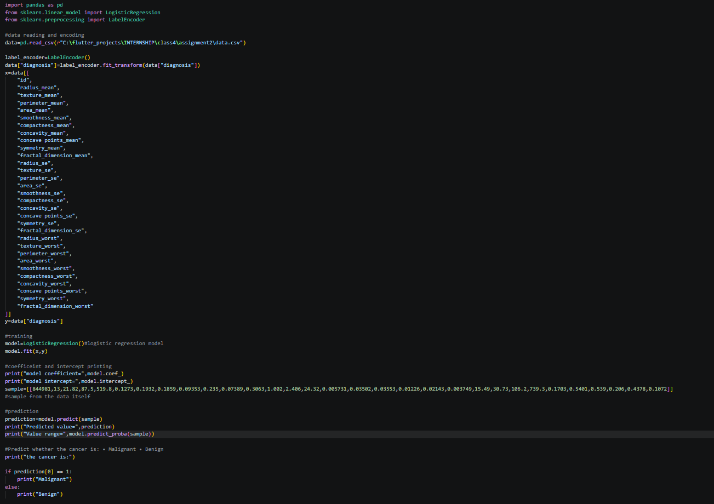
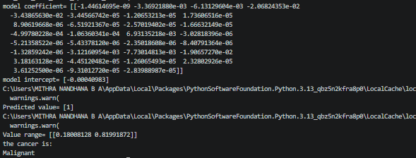

# assignment5-Logistic-Regression-2
Assignment 5 about Logistic Regression by Mithra Nandhana B A

## Problem Statement
Breast Cancer Prediction using Scikit-learn

## Answer
The code is saved in the `assignment5-Logistic-Regression-2/assignment/logistic.py/` along with the csv file containing the data.

The code and the output are given below.

## *Code*

## *Output*

## Final Answer
Predicted value= [1]
the cancer is:
Malignant

# What I Learned
By this assignment and class, I learned:
1. Logistic Regression Model

:D
